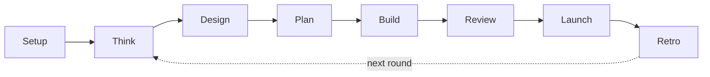

# Ship Framework

**An AI product team for one-person teams.** You bring the idea and the taste. Ship gives Claude Code
and Codex a product lead, a builder and five independent reviewers, and they remember what you decided.

[](https://github.com/ismailkose/ship-framework/releases)
[](LICENSE)


> **You:** `/shipmate add dark mode`\
> **Ship:** Plan first (it touches every screen), then build and review.\
> **Product lead:** Your users work evenings. Follow the system setting, or a toggle?\
> **You:** Follow the system.\
> **Builder:** Built on your design system: reused Card and ListRow, extended Chart.\
> **Visual check:** Contrast passes. One focus ring is 2.4:1 in dark (`Settings.swift:88`).\
> **You:** Fix it, then ship it.\
> **Release lead:** Review gate passed. Shipped.

*An illustrated session.* One command: Ship reads your project, says in one line what it's about
to do, asks only what it doesn't already know, and walks the work with you. You make the calls.

## What you get

Claude Code and Codex can already write your app. Ship makes them work like a product team:

- **Your decisions, kept.** Not in your head or old chats: decisions, design tokens, components and
  your taste live in files every session reads, so new code doesn't drift.
- **Reviewers who didn't write the code.** Up to five, unable to see each other. Every finding cites
  a file and line, a screenshot or test output, and launch waits for a clean review.
- **The craft at the right step.** Guides for forms, first runs, paywalls, motion and accessibility
  load where they matter, not only when you think to ask.
- **One command, sized to the job.** `/shipmate the login crashes`, `/shipmate make onboarding feel
  warmer`, `/shipmate ship it`. A copy fix stays small; a risky change gets planned and fully reviewed.
- **A team that pushes back.** The product lead asks who told you they need this. Review says
  "shippable, move on" when you're polishing. Retro notices three sessions on animation and none on
  payments.
- **Honest by default.** No fake urgency, guilt-trip buttons or hard cancels, and review blocks them.
  What's close to the line is your call, with guardrails.
- **What's missing, not only what's wrong** *(preview)*. Say "this feels generic" and Ship proposes
  a point of view and the three gaps that cost your users most.

## Install

**Claude Code**

```
/plugin marketplace add ismailkose/ship-framework
/plugin install ship-framework@ship-framework
```

**Codex, or Ship's files inside your repo**

```bash
git clone https://github.com/ismailkose/ship-framework.git
bash ship-framework/setup.sh my-app        # --dry-run shows what would change
```

**Your first request**

- **Claude Code:** type `/shipmate` and what you need (the menu lists it as
  `/ship-framework:shipmate`). An app you already have: `/shipmate adopt my design system`. A new
  idea: `/shipmate new idea: a booking app for my barbershop`.
- **Codex:** describe the task in plain words ("adopt my design system"); `AGENTS.md` maps it to
  the same steps.

As a plugin, Ship keeps its files out of your project:
it adds `CLAUDE.md` and its memory files only when you say yes, and never overwrites yours. Other
routes (Cowork, the `.plugin` file) and what differs between Claude and Codex are in
[CAPABILITIES.md](CAPABILITIES.md).

> [!NOTE]
> **Coming from 5.1?** The 21 `/ship-*` commands are now stages of `/shipmate`: `/ship-fix` is
> `/shipmate fix`, `/ship-team` is `/shipmate`. Details under **Updating** below.

## How it works



You don't walk this by hand. Ship picks where a request starts and how deep each step goes: a copy
fix goes straight to build and a quick check, a new product walks the whole path. Small fixes stay
small, and risky changes get the full review.

<details>
<summary><b>Steering words and stages</b></summary>

Say what you need in your own words. Put a stage name first only to steer:
`/shipmate review --full`, `/shipmate plan the sync feature`.

```
/shipmate the app crashes when I rotate on the stats screen
/shipmate                      # nothing after it: continue where you left off
/shipmate help                 # example requests
/shipmate status               # where things stand
```

| Stage | Its job | Skip or shrink when |
|:---|:---|:---|
| Think | Clarify what's uncertain; ask only what isn't already known | The answers are known |
| Design | Adopt an existing app's system, or plant a small seed, proven on a real screen | The change reuses what's registered |
| Plan | Resolve real choices and risks, then a build order, light or full | One obvious approach, low risk |
| Build | One feature, with the product's system and the right expertise; evidence it works | Never skipped |
| Review | Check the actual outcome with isolated reviewers sized to the change | Never skipped; depth shrinks |
| Launch | Fresh review, evidence-based gates, deploy, a check after deploy | No release intended |
| Retro | Keep decisions, corrections and lessons for the next round | Short, not absent |

Also: `fix` (reproduces first, then investigates), `variants` (options on a comparison board; your
pick is recorded as taste), `html` (a single-file prototype), `qa`, `browse`, `perf` (web speed gate),
`codex` (a second opinion), `money` (pricing, then the integration), `careful` · `freeze` · `guard`
· `unfreeze` (safety), `update`.

Before any work Ship gets the facts (setup, stack, design system, your changes, tasks, the last
review) and says in one line what it's doing and how to redirect it. It asks only when two readings
lead to different work, a step is hard to undo, or a product or taste call has no recorded answer.
Every session starts with one line: `Ship v… · Product · stack · 3 open task(s) · say what you need,
or /shipmate.`

In the plugin, the menu shows `/ship-framework:shipmate`; plain `/shipmate` works too. Without the
command, the plugin's router can still start Ship from a plain request: in our test of 20 requests,
it started Ship for all 10 product requests and stayed out of the 10 others. With `OPENAI_API_KEY`
set, design options can add image mockups, for direction only.

</details>

<details>
<summary><b>Your design system, kept as data</b></summary>

The design stage plants a **seed**: a short conversation becomes `design-model.yaml`, with real
tokens (color, type scale, spacing, radius, motion springs) in light and dark from day one, plus
your first components in `design/components.yaml`, rendered on a real screen. `DESIGN.md` keeps the
intent in prose, including the product's point of view. Already have an app? `/shipmate design
adopt` drafts both files from your code, keeps your names, and proves nothing moved.

One `design-model.yaml` generates SwiftUI, CSS variables, Tailwind v4 and Jetpack Compose, plus
previews. Generated files are never edited by hand: change the YAML and generate again.

Before every UI element the builder asks the registry: **reuse** it, **extend** it with a variant,
register a **new** reusable piece, or keep a one-off layout local. New tokens or changed visuals are
your call, as one question. After ten screens you don't have ten screens; you have a design system
that ten screens proved.

**Taste, in your words.** When you approve, reject or correct a design choice, Ship records it in
your words (`design/taste.yaml`, or `~/.ship/taste.yaml` for what holds across products), and agents
check it before UI, copy or motion work. In Claude Code, the **design gate** stops a new UI, motion
or copy file before the project has a design contract and points you to `/shipmate design`; fixes
to existing files are never blocked.

</details>

<details>
<summary><b>How review and launch decide</b></summary>

Product review, design review, the visual check (rendered screens only) and tests (it runs them)
work in parallel and can't see each other. On risky changes a second look challenges every finding
and hunts for misses. A copy tweak gets one or two reviewers; auth, payments or a release branch
gets all five.

Each review records a fingerprint of exactly what it saw. Launch passes only when that review is
still fresh, every selected reviewer actually finished, and no blocker is open. It gates on
evidence, not on a coverage percentage: failing tests, changed flows with no test or recorded check,
an invalid design registry, or a Core Web Vital rated "poor" on a main page.

</details>

<details>
<summary><b>The care review (preview)</b></summary>

"The booking flow feels generic", "what's missing?" or "make it feel cared for" starts a care pass.
Three reviewers each take one real task through the product with their own lens, and the report
gives:

- **Point of view:** who it's for and the moment they're in. If you haven't set one, Ship proposes
  it from the app, its copy and your README, and you confirm by picking between two concrete
  versions, never by typing adjectives.
- **Keep:** what already shows care, so nobody fixes it away.
- **At most three gaps**, ranked by what they cost the user, each with evidence, a fix and a way to
  check it.
- **Optional ideas** and **what wasn't checked**.

Nothing changes until you pick a gap. It's a preview, run on request: its evaluation on two sample
apps passed on one and slipped once in four runs on the other, so Ship makes no measured claim yet.

</details>

<details>
<summary><b>Where Ship's knowledge comes from</b></summary>

Each change is routed to the sources it needs, in one order: platform requirements and
accessibility, then your product decisions, your preferences, platform guidance (HIG, Material),
expert sources, Ship defaults, and last, agent guesses. An update can change the lower rungs; it
never quietly redesigns your product.

**Nothing else to install.** Ship's own references cover UX, motion, iOS, web, components,
hardening, the design registry, taste and review, each checked against Apple's, Google's and the
frameworks' docs and naming its sources. Declare your stack in `CLAUDE.md` and only the relevant
ones load. A skill you install yourself still works, and Ship lists where it's known to be wrong.
Motion follows Emil Kowalski's skills, ported under their MIT notice. Design and UX draw on the
classic books, GOV.UK's patterns, Nielsen's heuristics and Growth.Design's psychology principles,
in Ship's own words. Every source is in [CREDITS.md](CREDITS.md).

</details>

<details>
<summary><b>It adapts to how you work</b></summary>

The `## The Founder` section in your `CLAUDE.md` tells the team how you work:

```markdown
Background: Product designer
Technical comfort: Can read code and review diffs. Not architecting from scratch.
Decision style: One strong recommendation with clear reasoning.
Communication: Short and direct. Show, don't explain.
```

The builder stops over-explaining code you can read, review leads with design quality, and the
product lead gives one recommendation instead of three options if that's how you decide.

</details>

<details>
<summary><b>Claude and Codex in the same project</b></summary>

`CLAUDE.md` is yours and canonical. `AGENTS.md` is Ship's bridge for Codex (if you already have your
own, Ship writes its bridge to `.ship/AGENTS.ship.md`). Tasks, decisions, the design registry and
taste are shared, so you can switch tools mid-project without planning again. Codex runs reviews in
one context, labelled *not independent*; isolated reviewers, hooks and slash commands are
Claude-only. In Codex, describe the task; `AGENTS.md` maps it to the same stages.

</details>

<details>
<summary><b>Add your own skills</b></summary>

Put your skills in `.claude/skills/your-skills/` and wire each with a plain line under **Skills:**
in `CLAUDE.md`'s Ship section, for example `tailwind-patterns: load during build and review when
working on frontend files`. When `/shipmate` finds one that isn't wired, it offers once to add the
line. Your references go in `references/` under Custom References; they count as expert sources,
below your product decisions.

</details>

<details>
<summary><b>Updating, and coming from 5.1</b></summary>

**Plugin:** `claude plugin marketplace update ship-framework`, then
`claude plugin update ship-framework@ship-framework` (or turn on auto-update for the marketplace in
`/plugin` › Marketplaces), then restart or `/reload-plugins`.

**Project install:** `/shipmate update` in Claude Code, or `bash ship-update.sh` from your project
root (`--dry-run` to preview). Updates replace Ship's files and never yours; an edited copy of one
of Ship's files is saved to `.ship/backups/` first.

**From 5.1:** the 21 `/ship-*` commands are gone, with no aliases: they're stages of `/shipmate`
now. Update the way you did before (`/ship-update`, `bash ship-update.sh`, or the plugin commands
above); a project-install update removes the old command files and lists what it removed.

</details>

## Learn more

[Cheatsheet](CHEATSHEET.md) · [What works where](CAPABILITIES.md) · [Changelog](CHANGELOG.md) · [Credits](CREDITS.md)

Built by [Ismael Kose](https://github.com/ismailkose). Issues and pull requests are welcome; Ship's
checks run on our side. MIT license.
